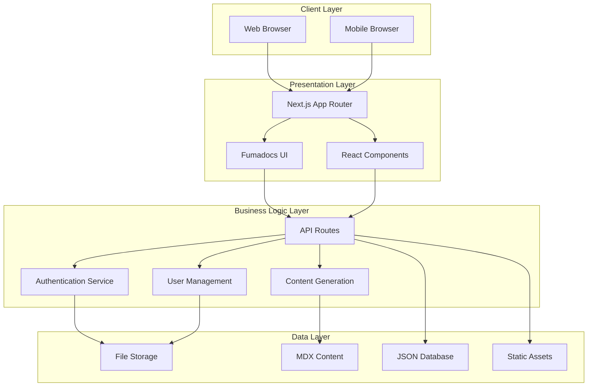
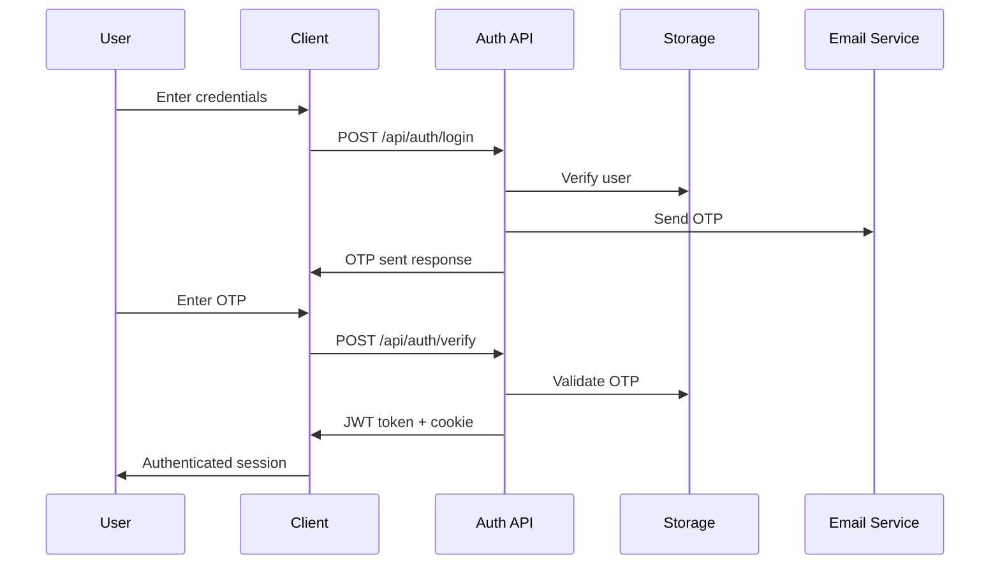
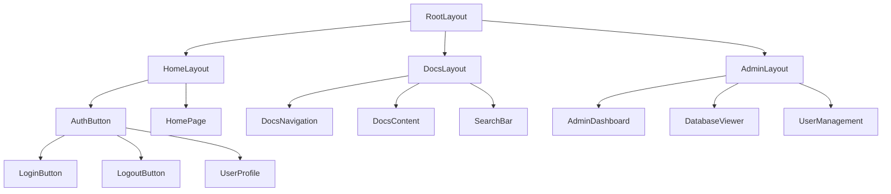
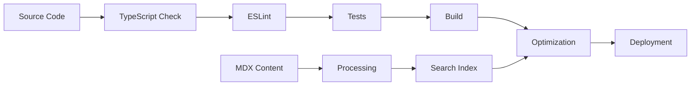
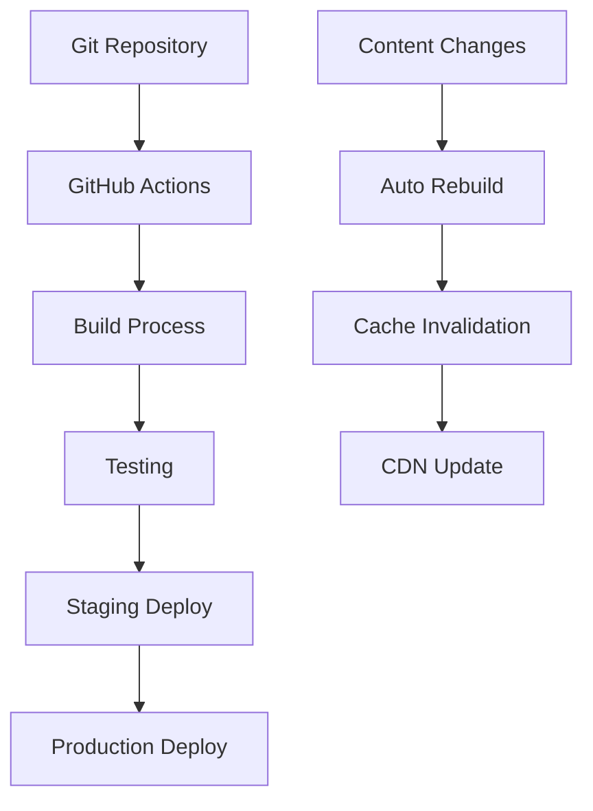

# System Architecture

The CEL Developer documentation platform is built on a modern, scalable architecture that combines Next.js, Fumadocs, and AI-powered content generation.

## 🏗️ High-Level Architecture



## 📁 Directory Structure

```
docs/
├── app/                          # Next.js App Router
│   ├── (home)/                   # Home page group
│   │   ├── layout.tsx           # Home layout
│   │   └── page.tsx             # Landing page
│   ├── admin/                    # Admin interface
│   │   ├── dashboard/           # Admin dashboard
│   │   └── database/            # Database viewer
│   ├── api/                     # API routes
│   │   ├── auth/                # Authentication endpoints
│   │   ├── admin/               # Admin-only endpoints
│   │   └── public/              # Public endpoints
│   ├── docs/                    # Documentation pages
│   │   └── [[...slug]]/         # Dynamic doc routing
│   ├── login/                   # Login page
│   ├── verify/                  # OTP verification
│   ├── global.css              # Global styles
│   ├── layout.config.tsx       # Layout configuration
│   └── layout.tsx              # Root layout
├── components/                   # React components
│   ├── AdminDashboard.tsx      # Admin interface
│   ├── AuthButton.tsx          # Authentication button
│   ├── DatabaseViewer.tsx      # Database display
│   └── PublicDatabaseViewer.tsx # Public database view
├── content/                     # MDX documentation
│   ├── docs/                   # Main documentation
│   └── project-management/     # Project docs
├── lib/                        # Utility libraries
│   ├── auth.ts                 # Authentication logic
│   ├── edge-config.ts          # Configuration service
│   ├── file-storage.ts         # File-based storage
│   └── source.ts               # Content source
├── public/                     # Static assets
│   ├── admin-login.html        # Admin login helper
│   └── test-logout.html        # Logout test page
├── types/                      # TypeScript definitions
│   └── auth.ts                 # Authentication types
└── .storage/                   # Development data (gitignored)
    ├── users.json              # User accounts
    └── otps.json               # OTP codes
```

## 🔐 Authentication Architecture

### Authentication Flow



### Security Components

#### JWT Token Structure
```typescript
interface JWTPayload {
  user: {
    id: string;
    email: string;
    name: string;
    role: 'admin' | 'member' | 'customer';
  };
  iat: number; // Issued at
  exp: number; // Expiration
}
```

#### Cookie Configuration
```typescript
const cookieOptions = {
  httpOnly: true,                    // Prevent XSS
  secure: process.env.NODE_ENV === 'production', // HTTPS only in prod
  sameSite: 'strict' as const,      // CSRF protection
  maxAge: 7 * 24 * 60 * 60,        // 7 days
  path: '/',                        // Available site-wide
};
```

#### Role-Based Access Control
```typescript
interface RolePermissions {
  admin: {
    read: ['*'];
    write: ['*'];
    delete: ['*'];
    manage: ['users', 'content', 'system'];
  };
  member: {
    read: ['docs', 'projects'];
    write: ['docs', 'comments'];
    delete: ['own-content'];
    manage: [];
  };
  customer: {
    read: ['public-docs'];
    write: [];
    delete: [];
    manage: [];
  };
}
```

## 🗄️ Data Architecture

### Storage Strategy

#### File-Based Storage (Development)
```typescript
interface StorageStructure {
  users: {
    file: '.storage/users.json';
    structure: User[];
    operations: ['create', 'read', 'update', 'delete'];
  };
  otps: {
    file: '.storage/otps.json';
    structure: OTP[];
    operations: ['create', 'read', 'update', 'expire'];
  };
}
```

#### Content Management
```typescript
interface ContentStructure {
  docs: {
    location: 'content/docs/';
    format: 'MDX';
    features: ['frontmatter', 'components', 'code-highlighting'];
  };
  projects: {
    location: 'content/project-management/';
    format: 'MDX';
    features: ['navigation', 'cross-references', 'version-control'];
  };
}
```

### Data Models

#### User Model
```typescript
interface User {
  id: string;                    // Unique identifier
  email: string;                 // Login email
  name: string;                  // Display name
  password: string;              // Hashed password
  role: 'admin' | 'member' | 'customer';
  isActive: boolean;             // Account status
  createdAt: string;             // ISO timestamp
  lastLogin?: string;            // Last login time
  metadata?: {                   // Additional data
    preferences: UserPreferences;
    permissions: CustomPermissions;
  };
}
```

#### OTP Model
```typescript
interface OTP {
  id: string;                    // Unique identifier
  email: string;                 // Associated email
  code: string;                  // 6-digit code
  expiresAt: string;            // ISO timestamp
  attempts: number;              // Failed attempts
  isUsed: boolean;              // Usage status
  createdAt: string;            // Creation time
}
```

## 🚀 API Architecture

### RESTful Endpoints

#### Authentication Endpoints
```typescript
// Public Authentication
POST   /api/auth/login           // User login
POST   /api/auth/verify          // OTP verification
POST   /api/auth/logout          // User logout
GET    /api/auth/me              // Current user info

// Development Helpers
GET    /api/dev/get-otp          // Get OTP for testing
```

#### Admin Endpoints
```typescript
// User Management
GET    /api/admin/users          // List all users
POST   /api/admin/users          // Create new user
PATCH  /api/admin/users/[id]     // Update user
DELETE /api/admin/users/[id]     // Delete user

// Database Operations
GET    /api/admin/database       // Admin database view
GET    /api/admin/database/json  // Raw JSON export
```

#### Public Endpoints
```typescript
// Public Access
GET    /api/public/users         // Public user list
GET    /api/public/database      // Public database view
POST   /api/public/users         // Public user creation
```

### API Response Standards

#### Success Response
```typescript
interface SuccessResponse<T> {
  success: true;
  message: string;
  data?: T;
  metadata?: {
    timestamp: string;
    version: string;
    requestId: string;
  };
}
```

#### Error Response
```typescript
interface ErrorResponse {
  success: false;
  message: string;
  error?: {
    code: string;
    details: string;
    stack?: string; // Development only
  };
  metadata?: {
    timestamp: string;
    requestId: string;
  };
}
```

## 🎨 Frontend Architecture

### Component Hierarchy



### State Management

#### Authentication State
```typescript
interface AuthState {
  user: User | null;
  isLoading: boolean;
  isAuthenticated: boolean;
  permissions: string[];
}

// Context Provider
const AuthContext = createContext<AuthState | null>(null);

// Custom Hook
function useAuth(): AuthState {
  const context = useContext(AuthContext);
  if (!context) {
    throw new Error('useAuth must be used within AuthProvider');
  }
  return context;
}
```

#### UI State Management
```typescript
interface UIState {
  theme: 'light' | 'dark' | 'system';
  sidebar: {
    isOpen: boolean;
    activeSection: string;
  };
  notifications: Notification[];
  loading: {
    [key: string]: boolean;
  };
}
```

### Responsive Design

#### Breakpoint Strategy
```css
/* Mobile First Approach */
.container {
  @apply w-full px-4;
}

/* Tablet */
@media (min-width: 768px) {
  .container {
    @apply px-6;
  }
}

/* Desktop */
@media (min-width: 1024px) {
  .container {
    @apply px-8 max-w-7xl mx-auto;
  }
}

/* Large Desktop */
@media (min-width: 1280px) {
  .container {
    @apply px-12;
  }
}
```

## 🔧 Development Architecture

### Build Pipeline



### Development Tools

#### Code Quality
```json
{
  "scripts": {
    "dev": "next dev",
    "build": "next build",
    "start": "next start",
    "lint": "next lint",
    "type-check": "tsc --noEmit",
    "test": "jest",
    "test:watch": "jest --watch"
  }
}
```

#### Environment Configuration
```typescript
interface EnvironmentConfig {
  development: {
    storage: 'file-system';
    auth: 'jwt-local';
    logging: 'console';
    debugging: true;
  };
  staging: {
    storage: 'edge-config';
    auth: 'jwt-secure';
    logging: 'structured';
    debugging: true;
  };
  production: {
    storage: 'edge-config';
    auth: 'jwt-secure';
    logging: 'structured';
    debugging: false;
  };
}
```

## 📊 Performance Architecture

### Optimization Strategies

#### Client-Side Optimization
- **Code Splitting** - Dynamic imports for route-based splitting
- **Image Optimization** - Next.js Image component with WebP
- **Bundle Analysis** - Webpack bundle analyzer integration
- **Caching Strategy** - Browser caching for static assets

#### Server-Side Optimization
- **Static Generation** - Pre-build static pages where possible
- **Incremental Regeneration** - Update static content on demand
- **API Caching** - Response caching for expensive operations
- **Database Optimization** - Efficient queries and indexing

### Monitoring and Analytics

#### Performance Metrics
```typescript
interface PerformanceMetrics {
  pageLoad: {
    fcp: number;      // First Contentful Paint
    lcp: number;      // Largest Contentful Paint
    fid: number;      // First Input Delay
    cls: number;      // Cumulative Layout Shift
  };
  api: {
    responseTime: number;
    errorRate: number;
    throughput: number;
  };
  user: {
    bounceRate: number;
    sessionDuration: number;
    conversionRate: number;
  };
}
```

## 🔄 Deployment Architecture

### Deployment Strategy



### Infrastructure

#### Vercel Configuration
```json
{
  "version": 2,
  "builds": [
    {
      "src": "package.json",
      "use": "@vercel/next"
    }
  ],
  "routes": [
    {
      "src": "/api/(.*)",
      "dest": "/api/$1"
    },
    {
      "src": "/(.*)",
      "dest": "/$1"
    }
  ],
  "env": {
    "NODE_ENV": "production"
  }
}
```

This architecture provides a robust, scalable foundation for the CEL Developer documentation platform, enabling efficient content management, user authentication, and AI-powered documentation generation.
