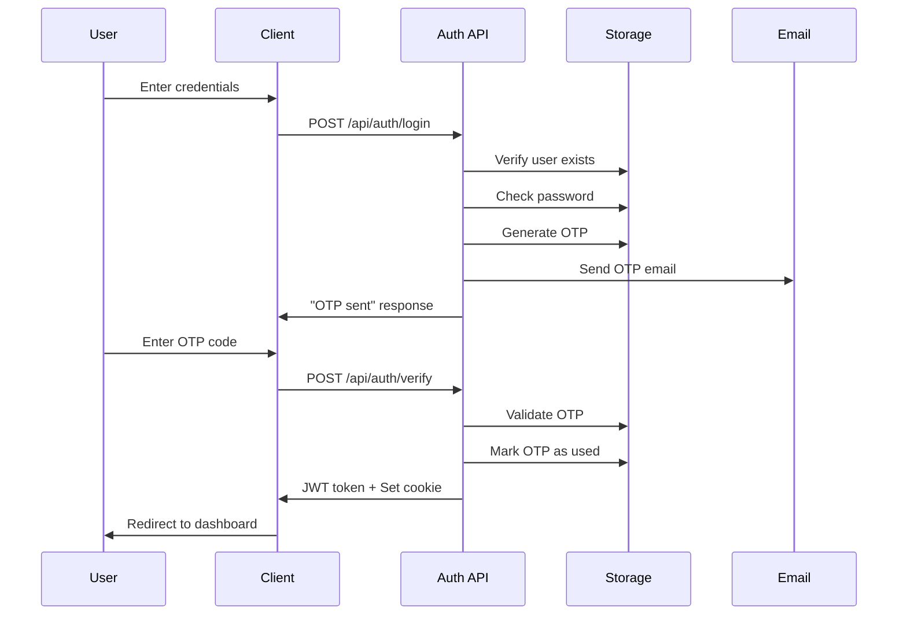
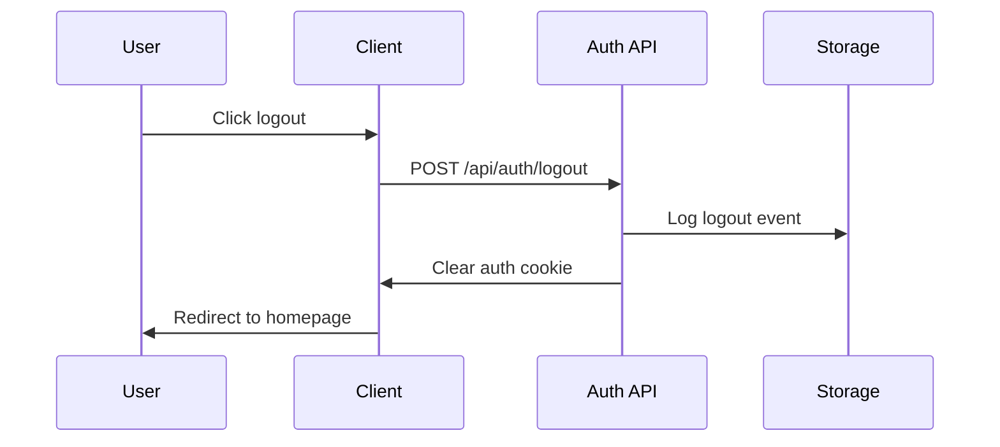
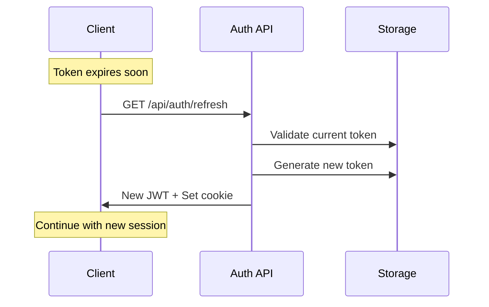

# Authentication Guide

The CEL Developer platform implements a robust authentication system with role-based access control, email verification, and secure session management.

## 🔐 Authentication Overview

### Security Features
- **JWT-based Authentication** - Secure token-based session management
- **Email Verification** - OTP-based two-factor authentication
- **Role-based Access Control** - Granular permissions by user role
- **Secure Cookies** - HTTP-only cookies for token storage
- **Session Management** - Automatic logout and timeout handling

### User Roles

#### Admin
- **Full System Access** - Complete administrative privileges
- **User Management** - Create, edit, and delete user accounts
- **Database Access** - View and manage all system data
- **Configuration** - System settings and permissions

#### Member
- **Documentation Access** - Read and contribute to documentation
- **Project Participation** - Access to project management features
- **Profile Management** - Edit personal information and preferences
- **Limited Admin Functions** - Basic reporting and analytics

#### Customer
- **Public Documentation** - Access to publicly available content
- **Basic Profile** - View and edit basic profile information
- **Support Access** - Submit tickets and access help resources
- **Limited Features** - Restricted to customer-facing functionality

## 🚀 Getting Started

### User Registration

#### Admin User Creation
Admins can create new users through the admin dashboard:

1. **Access Admin Dashboard**
   ```
   Navigate to: /admin/dashboard
   ```

2. **Create New User**
   - Click "Create New User" button
   - Fill in user details:
     - Email address
     - Full name
     - Role selection (admin/member/customer)
   - System generates default password: `newuser123`

3. **User Notification**
   - New user receives email with credentials
   - Must change password on first login

#### Self-Registration (if enabled)
```typescript
// Public user creation endpoint
POST /api/public/users
{
  "email": "user@example.com",
  "name": "User Name",
  "role": "customer" // Default role
}
```

### Login Process

#### Step 1: Initial Authentication
```typescript
// Login request
POST /api/auth/login
{
  "email": "user@example.com",
  "password": "userpassword"
}

// Response
{
  "success": true,
  "message": "Verification code sent to your email address."
}
```

#### Step 2: Email Verification
1. **Check Email** - User receives OTP code via email
2. **Enter Code** - Submit 6-digit verification code
3. **Complete Login** - Receive authentication token

```typescript
// OTP verification
POST /api/auth/verify
{
  "email": "user@example.com",
  "code": "123456"
}

// Success response
{
  "success": true,
  "message": "Login successful.",
  "token": "eyJhbGciOiJIUzI1NiIs...",
  "data": {
    "user": {
      "id": "user-id",
      "email": "user@example.com",
      "name": "User Name",
      "role": "member"
    }
  }
}
```

## 🔧 Technical Implementation

### JWT Token Structure

```typescript
interface JWTPayload {
  user: {
    id: string;
    email: string;
    name: string;
    role: 'admin' | 'member' | 'customer';
  };
  iat: number; // Issued at timestamp
  exp: number; // Expiration timestamp
}
```

### Cookie Configuration

```typescript
const cookieOptions = {
  httpOnly: true,                    // Prevent XSS attacks
  secure: process.env.NODE_ENV === 'production', // HTTPS only in production
  sameSite: 'strict' as const,      // CSRF protection
  maxAge: 7 * 24 * 60 * 60,        // 7 days in seconds
  path: '/',                        // Available site-wide
};
```

### Password Security

#### Hashing
```typescript
import bcrypt from 'bcryptjs';

// Password hashing during registration
const saltRounds = 12;
const hashedPassword = await bcrypt.hash(plainPassword, saltRounds);

// Password verification during login
const isValid = await bcrypt.compare(plainPassword, hashedPassword);
```

#### Password Requirements
- **Minimum Length** - 8 characters
- **Complexity** - Mix of letters, numbers, and symbols (recommended)
- **History** - Cannot reuse last 5 passwords (future enhancement)
- **Expiration** - Optional password expiry (configurable)

## 🛡️ Security Features

### OTP (One-Time Password) System

#### Generation
```typescript
interface OTP {
  id: string;
  email: string;
  code: string;        // 6-digit numeric code
  expiresAt: string;   // ISO timestamp (5 minutes)
  attempts: number;    // Failed verification attempts
  isUsed: boolean;     // Usage status
  createdAt: string;   // Creation timestamp
}
```

#### Validation Rules
- **Expiration** - OTP expires after 5 minutes
- **Single Use** - Each OTP can only be used once
- **Rate Limiting** - Maximum 3 verification attempts
- **Cleanup** - Expired OTPs are automatically removed

### Session Management

#### Token Lifecycle
```typescript
interface SessionConfig {
  tokenExpiry: '7d';           // 7 days
  refreshThreshold: '1d';      // Refresh if expires within 1 day
  maxConcurrentSessions: 3;    // Limit active sessions
  inactivityTimeout: '30m';    // Auto-logout after inactivity
}
```

#### Session Validation
```typescript
// Middleware for protected routes
export async function validateSession(request: NextRequest) {
  const token = request.cookies.get('auth-token')?.value;
  
  if (!token) {
    return { valid: false, error: 'No token provided' };
  }
  
  try {
    const decoded = jwt.verify(token, JWT_SECRET) as JWTPayload;
    return { valid: true, user: decoded.user };
  } catch (error) {
    return { valid: false, error: 'Invalid token' };
  }
}
```

### Access Control

#### Route Protection
```typescript
// Page-level protection
export default async function ProtectedPage() {
  const cookieStore = cookies();
  const token = cookieStore.get('auth-token')?.value;
  
  if (!token) {
    redirect('/login?redirect=/protected-page');
  }
  
  const user = verifyToken(token);
  if (!user) {
    redirect('/login?redirect=/protected-page');
  }
  
  return <ProtectedContent user={user} />;
}
```

#### API Protection
```typescript
// API route protection
export async function GET(request: NextRequest) {
  const token = request.cookies.get('auth-token')?.value;
  
  if (!token) {
    return NextResponse.json(
      { success: false, message: 'Unauthorized' },
      { status: 401 }
    );
  }
  
  const user = verifyToken(token);
  if (!user || user.role !== 'admin') {
    return NextResponse.json(
      { success: false, message: 'Insufficient permissions' },
      { status: 403 }
    );
  }
  
  // Proceed with authorized operation
}
```

#### Role-Based Components
```typescript
interface RoleGuardProps {
  roles: ('admin' | 'member' | 'customer')[];
  children: React.ReactNode;
  fallback?: React.ReactNode;
}

function RoleGuard({ roles, children, fallback }: RoleGuardProps) {
  const { user } = useAuth();
  
  if (!user || !roles.includes(user.role)) {
    return fallback || <div>Access Denied</div>;
  }
  
  return <>{children}</>;
}

// Usage
<RoleGuard roles={['admin']}>
  <AdminOnlyFeature />
</RoleGuard>
```

## 🔄 Authentication Flows

### Login Flow



### Logout Flow



### Session Refresh



## 🔍 Monitoring & Analytics

### Authentication Events

```typescript
interface AuthEvent {
  type: 'login' | 'logout' | 'failed_login' | 'otp_sent' | 'otp_verified';
  userId?: string;
  email: string;
  timestamp: string;
  ip: string;
  userAgent: string;
  success: boolean;
  details?: {
    attemptCount?: number;
    errorReason?: string;
    sessionId?: string;
  };
}
```

### Security Metrics

#### Login Analytics
- **Success Rate** - Percentage of successful logins
- **Failed Attempts** - Tracking of failed login attempts
- **OTP Delivery** - Email delivery success rates
- **Session Duration** - Average user session length

#### Security Monitoring
- **Suspicious Activity** - Multiple failed attempts from same IP
- **Token Validation** - Invalid token usage patterns
- **Session Anomalies** - Unusual session behavior
- **Role Escalation** - Unauthorized access attempts

## 🛠️ Development & Testing

### Environment Setup

#### Development Configuration
```typescript
// .env.local
JWT_SECRET=your-development-secret-key
EMAIL_PROVIDER=console  // Log OTPs to console
SESSION_TIMEOUT=30m
DEBUG_AUTH=true
```

#### Testing Helpers
```typescript
// Development-only endpoints
GET /api/dev/get-otp?email=user@example.com  // Get current OTP
POST /api/dev/create-user                     // Quick user creation
GET /api/dev/clear-sessions                   // Clear all sessions
```

### Testing Authentication

#### Manual Testing
1. **Login Flow Testing**
   ```bash
   # Test login
   curl -X POST http://localhost:3000/api/auth/login \
     -H "Content-Type: application/json" \
     -d '{"email":"test@example.com","password":"password123"}'
   
   # Get OTP (development only)
   curl http://localhost:3000/api/dev/get-otp?email=test@example.com
   
   # Verify OTP
   curl -X POST http://localhost:3000/api/auth/verify \
     -H "Content-Type: application/json" \
     -d '{"email":"test@example.com","code":"123456"}' \
     -c cookies.txt
   
   # Test protected endpoint
   curl -X GET http://localhost:3000/api/auth/me \
     -b cookies.txt
   ```

#### Automated Testing
```typescript
describe('Authentication', () => {
  test('should login successfully with valid credentials', async () => {
    const response = await request(app)
      .post('/api/auth/login')
      .send({ email: 'test@example.com', password: 'password123' })
      .expect(200);
    
    expect(response.body.success).toBe(true);
    expect(response.body.message).toContain('Verification code sent');
  });
  
  test('should reject invalid credentials', async () => {
    const response = await request(app)
      .post('/api/auth/login')
      .send({ email: 'test@example.com', password: 'wrongpassword' })
      .expect(401);
    
    expect(response.body.success).toBe(false);
  });
});
```

## 🚨 Troubleshooting

### Common Issues

#### Login Problems
**Issue**: "User not found" error
**Solution**: Verify user exists in the system and email is correct

**Issue**: OTP not received
**Solution**: Check email spam folder, verify email service configuration

**Issue**: "Invalid token" error
**Solution**: Clear cookies and login again, check token expiration

#### Permission Issues
**Issue**: "Access denied" for admin features
**Solution**: Verify user role is set to 'admin' in the database

**Issue**: Session expires quickly
**Solution**: Check JWT_SECRET configuration and cookie settings

#### Development Issues
**Issue**: Authentication not working locally
**Solution**: Verify .env.local file exists with proper JWT_SECRET

**Issue**: CORS errors during login
**Solution**: Check Next.js configuration and API route setup

### Error Codes

```typescript
enum AuthErrorCodes {
  INVALID_CREDENTIALS = 'AUTH_001',
  USER_NOT_FOUND = 'AUTH_002',
  INVALID_OTP = 'AUTH_003',
  OTP_EXPIRED = 'AUTH_004',
  TOO_MANY_ATTEMPTS = 'AUTH_005',
  INVALID_TOKEN = 'AUTH_006',
  INSUFFICIENT_PERMISSIONS = 'AUTH_007',
  SESSION_EXPIRED = 'AUTH_008',
}
```

### Debug Tools

#### Authentication Debug Component
```typescript
function AuthDebug() {
  const { user, isAuthenticated } = useAuth();
  
  if (process.env.NODE_ENV !== 'development') {
    return null;
  }
  
  return (
    <div className="fixed bottom-4 right-4 p-4 bg-gray-800 text-white rounded">
      <h3>Auth Debug</h3>
      <p>Authenticated: {isAuthenticated ? 'Yes' : 'No'}</p>
      {user && (
        <div>
          <p>Email: {user.email}</p>
          <p>Role: {user.role}</p>
          <p>ID: {user.id}</p>
        </div>
      )}
    </div>
  );
}
```

This authentication system provides a secure, scalable foundation for user management and access control in the CEL Developer platform.
